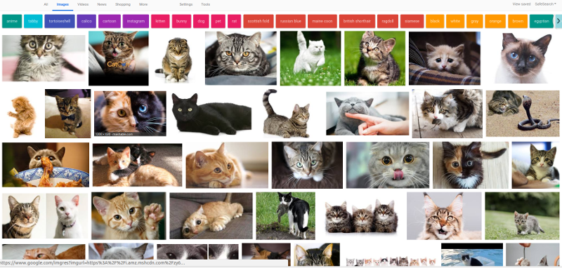

# My Libraries

A set of miscellenanous codes for Raspberry Pi, AI, Data gathering, etc...

# Table of Contents

### 1. Raspberry Pi

A set of codes for raspberry pi

#### 1.1. [Video stream with Picamera](#Video stream with Picamera)

#### 1.2. [GSTream](#GStream) 

#### 1.3. [GSTream Thread](#GStream Thread)

#### 1.4. [Video and Telemetry stream with Picamera](#Video and Telemetry stream with Picamera)

### 2. Web Crawling

#### 2.1. [Create Image dataset with Google Image](#Create Image dataset with Google Image)

### 3. Math

#### 3.1. [Compute Gradient with Theano](#Compute Gradient with Theano)
--------------

# 1.Raspberry Pi modules

## 1.1. Video stream with Picamera
A script that enables to stream images at high fps from  Raspberry Pi to a laptop/desktop.
The script uses the `PiCamera` library. You may also check out this [analysis](https://github.com/jmlb/my_libraries/blob/master/vidstream_picamera/Experiments/Plots.ipynb) of the performance of different image capture method: `capture continuous` versus `capture sequence`. 
[link](https://github.com/jmlb/my_libraries/tree/master/vidstream_picamera)

## 1.2. GStream
Stream MJPEG format using GStreamer
[link](https://github.com/jmlb/my_libraries/tree/master/gstream)

## 1.3. GStream Thread
Streaming Video (MJPEG) and telemetry (Data) from Raspberry Pi to a html page. 
The includes extraction of time stamp.
[link](https://github.com/jmlb/my_libraries/tree/master/gstream_thread)

### 1.4. Video and Telemetry stream with Picamera
The telemetry data is data recorded from an accelerometer attached to the RPi.
[link](https://github.com/jmlb/my_libraries/tree/master/gstream_thread_vid_acc)

# 2. Web crawling

## 2.1. Create Image dataset with Google Image
Gather images from Google Image to create a dataset to train Deep Learning Models.
[link](https://github.com/jmlb/my_libraries/tree/master/google_image_download)

# 3. Math

## 3.1. Compute Gradient with Theano
This is a toy example that shows how to use **Theano** to compute the gradient.
[link](https://github.com/jmlb/my_libraries/tree/master/Theano_Gradient/gradient_calculation.ipynb)

---

*Contact:*
Let me know if you have questions/suggestions. Feel free to connect with me on [LinkedIn](https://www.linkedin.com/in/jmlbeaujour/).# RPi_libraries